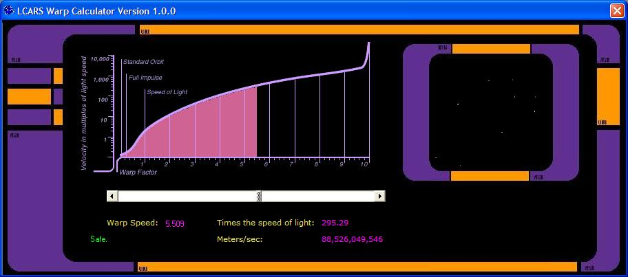



## StarTrek LCARS Warp Calculator

### Description

I just wrote this software for fun. and i once saw another program that did the same thing and i thought to my self i could do better
 
### More Info
 

             |
---                |---
**Submitted On**   |2002-07-16 17:08:18
**By**             |[Arpa Joakim](https://github.com/Planet-Source-Code/PSCIndex/blob/master/ByAuthor/arpa-joakim.md)
**Level**          |Beginner
**User Rating**    |4.7 (14 globes from 3 users)
**Compatibility**  |VB 6\.0
**Category**       |[Graphics](https://github.com/Planet-Source-Code/PSCIndex/blob/master/ByCategory/graphics__1-46.md)
**World**          |[Visual Basic](https://github.com/Planet-Source-Code/PSCIndex/blob/master/ByWorld/visual-basic.md)
**Archive File**   |[StarTrek\_L1070037162002\.zip](https://github.com/Planet-Source-Code/arpa-joakim-startrek-lcars-warp-calculator__1-36965/archive/master.zip)

